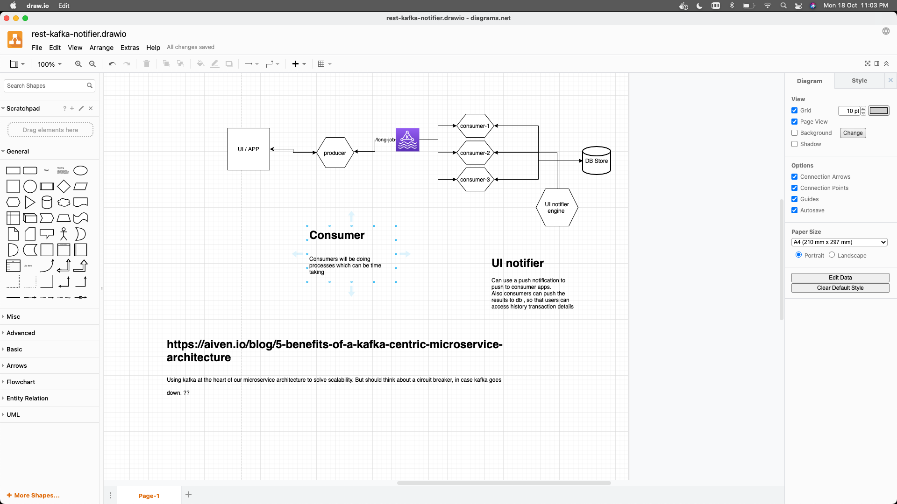

# event-driven-architectures
Event driven microservice architecture notes

To solve the problem of scalability we can keep Kafka at the center of our microserivice architecture. But will it make a spaggetti architecture on long run??
https://aiven.io/blog/5-benefits-of-a-kafka-centric-microservice-architecture

